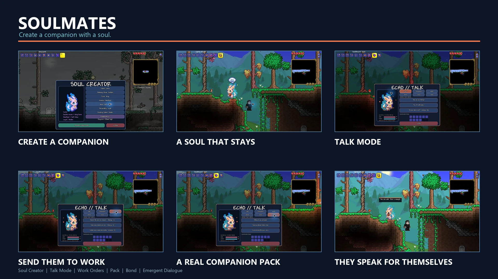
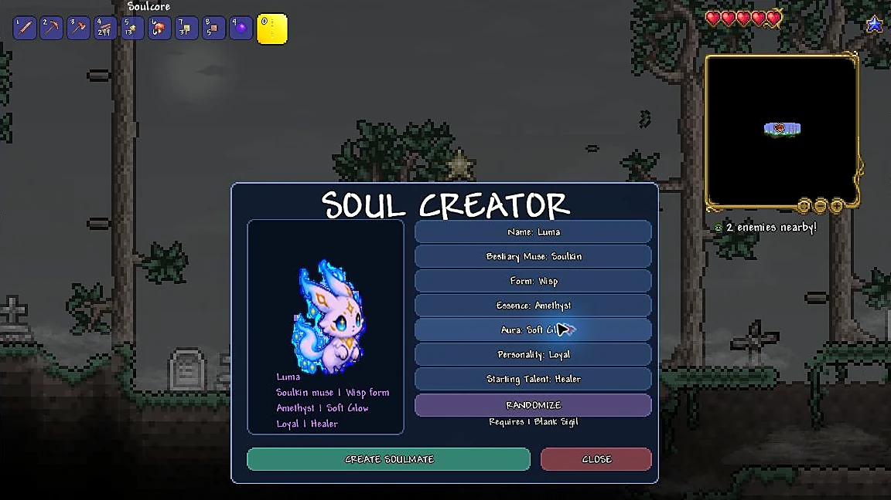
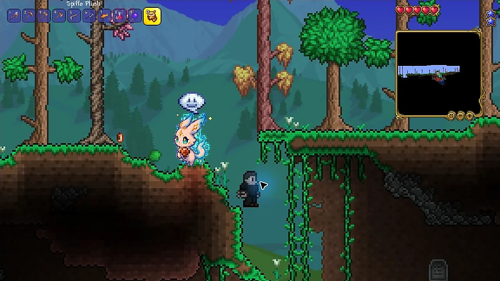
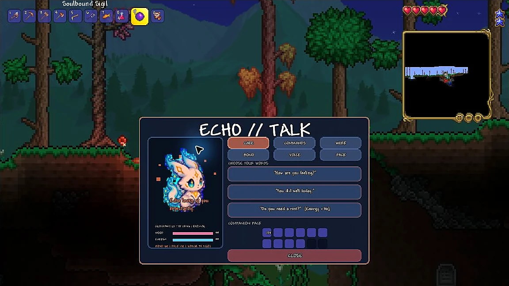
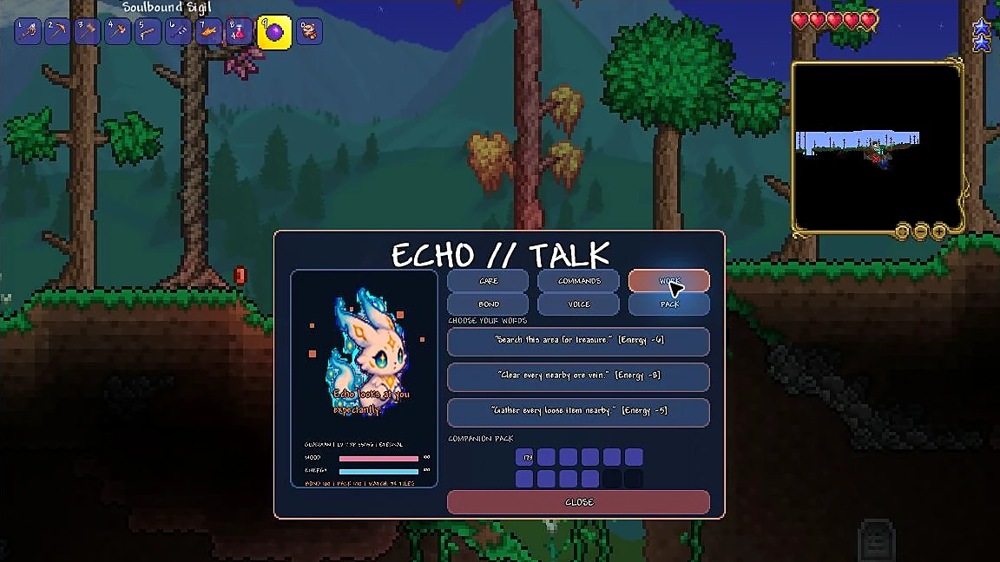
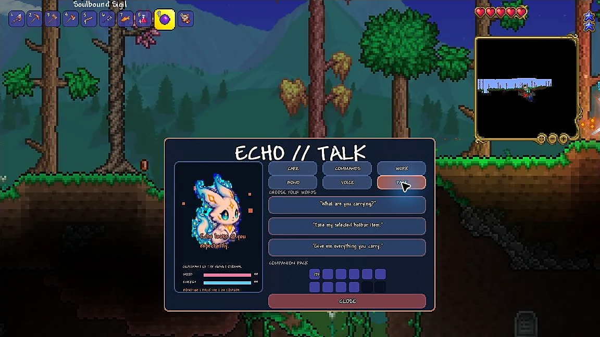
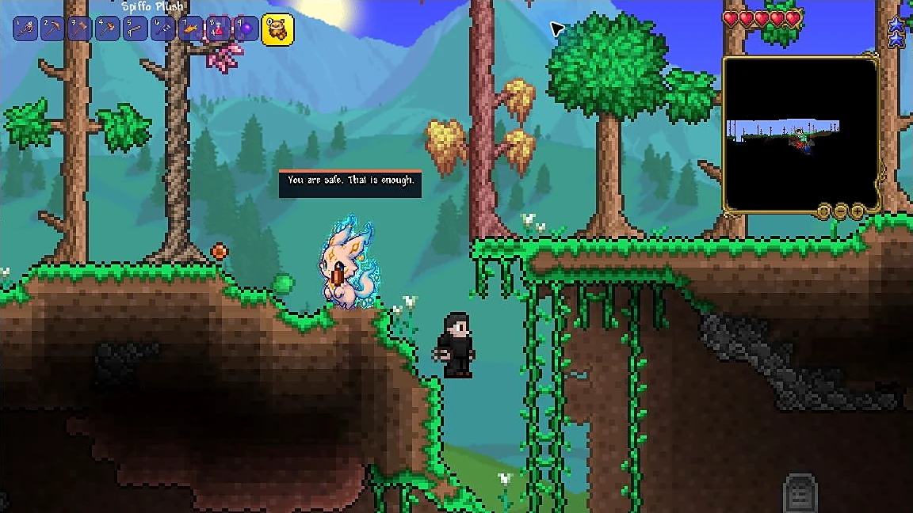

# Soulmates

Soulmates is a tModLoader mod about creating companions that feel personal. The reusable **Soulcore** opens a small companion creator. Each finished companion is stored in its own **Soulbound Sigil** with a persistent name, appearance, personality, talent, bond, mood, and energy.

## In-game gallery

| Soul Creator | Living companion |
| --- | --- |
|  |  |

| Talk Mode | Work orders |
| --- | --- |
|  |  |

| Companion pack | Emergent dialogue |
| --- | --- |
|  |  |

## AI-assisted development disclosure

Soulmates is an experimental project created with extensive AI assistance across programming, writing, interface work, and visual development. The Workshop icon, mod icon, and custom Soulkin sprite were AI-generated and then integrated into the mod. The current Bunny, Blue Slime, Bird, Squirrel, item, and inventory visuals reuse Terraria assets as placeholders. Features are reviewed and tested in-game by the creator before release.

## Features

- Craft a reusable Soulcore and Blank Sigils.
- Receive one Soulcore and three Blank Sigils once per character as a prototype starter kit.
- Create multiple unique companions from fully localized presets.
- Shape a companion through an animated live preview with an original eight-frame Soulkin sprite, including compatibility for existing Sigils.
- Choose a name, form, essence color, aura, personality, and starting talent.
- Choose a visual Bestiary Muse: Soulkin, Bunny, Blue Slime, Bird, or Squirrel.
- Summon exactly one active companion at a time; switching Sigils cleanly retires the previous companion, assignment, and projectiles.
- Right-click the summoned companion itself to open a compact eight-action radial menu.
- Hold Up and right-click the Sigil to recall it.
- Companion identity and progression data are saved on the Sigil.
- Personality-driven idle, wander, inspect, follow, and catch-up behavior.
- Persistent per-companion autonomy, switchable from the action wheel.
- Talent-driven initiative: every companion retrieves nearby usable drops, Gatherers do so faster and farther, Miners help in short bursts and collect what they mine, Treasure Seekers investigate nearby chests, Guardians intercept danger, and Healers react to injuries.
- Persistent learning insights adapt to the owner's gathering, mining, forestry, combat, and exploration habits.
- The learned Forester perk lets a companion shake trees, clear natural fallen logs, collect seeds, and carefully replant carried acorns.
- A companion named **AETHER** is an Omni Soul with every starting talent instinct and learned perk available.
- Personality-driven autonomous moments add small surprises without overriding combat, Stay, explicit assignments, or low-energy recovery.
- Persistent companion experience with 20 levels earned from combat, healing, work, and shared moments.
- Right-click directly on your own character to open Terraria's complete native emote menu, including original vanilla and modded emote graphics. The configurable **Companion Emote Wheel** key (`G` by default) keeps the compact six-action relationship wheel.
- Native Terraria emote bubbles for shared gestures, with occasional context-aware speech instead of constant text.
- Quiet social encounters with nearby town NPCs: companions approach, emote, and receive a native NPC response.
- Personality-specific reactions to normal victories, bosses, and creature deaths.
- Talk Mode with Care, Commands, Work, Bond, Voice, and Pack conversations.
- Mood-, energy-, bond-, and personality-aware replies, including clearly explained refusals.
- Five visible bond ranks with growing work radius, role strength, and pack capacity.
- Every companion continuously defends against nearby threats without spending work energy, while staying leashed to its owner or Stay anchor; Guardians react faster, reach farther, and hit harder, while Healers provide energy-limited support.
- Energy returns naturally outside work and combat, with faster recovery while waiting; the Care > Rest conversation is an optional boost rather than a required chore.
- Area assignments: locate nearby chests, clear every early-ore vein in range, and retrieve every loose item in range.
- A persistent memory chronicle covering creation, work, protection, healing, equipment, and bond milestones.
- Craftable Starfinder Bell, Delver Charm, and Hearth Ribbon companion trinkets.
- Resting companions recover mood and energy over time.
- Every companion has a persistent 8-stack pack; the Hearth Ribbon expands it to 12.
- The Pack conversation can inspect cargo, store the selected hotbar item, or unload everything.
- Pack slots have item tooltips and return a full stack on left-click or one item on right-click.
- Companions illuminate dark spaces and reveal the nearby world map as they explore.
- Work refusals are deterministic and explain whether mood or energy is too low.
- Active assignments survive recalls and summons, end when the area is clear, and report when the companion needs a new assignment.
- Press the configurable **Talk to Companion** hotkey (`V` by default) to open Talk Mode without selecting the Sigil.
- Choose **Details** on the companion action wheel, or press `V`, to open the complete Talk Mode with level, bond, mood, energy, pack, memories, and conversations.
- Stay is a true world anchor: companions defend that location without drifting back to the player.
- Play in English or German; Soulmates follows Terraria's selected language automatically.

The current release supports single-player and server-authoritative multiplayer companions. Summoning, recalling, conversations, jobs, pack actions, and trinkets are validated by the server and synchronized back to the owning player.

## Current release

**Soulmates 0.8.2 - Visible Forestry** lets every autonomous companion shake nearby trees and clear fallen logs. Gatherers, AETHER, and companions who learn Forester gain advanced multi-target forestry and acorn planting, with progress shown directly in details and Sigil tooltips. Loot Flow's coordinated pickup, immediate retargeting, pack safety, item reservations, and server authority remain intact, as do natural recovery, native emotes, and existing Soulbound Sigil compatibility.

## Languages

- English
- German / Deutsch

English is used as the fallback when Terraria is set to another language.

## Install for development

1. Install Terraria and tModLoader through Steam.
2. Copy or clone this folder into `Documents/My Games/Terraria/tModLoader/ModSources/Soulmates`.
3. Open tModLoader and choose **Workshop > Develop Mods > Build + Reload**.

The project targets the current tModLoader 1.4.4 stable release. In the normal ModSources folder the project automatically uses `tModLoader.targets`. For development elsewhere, set `TML_PATH` to a tModLoader installation containing `tMLMod.targets`.

## Prototype recipes

- **Soulcore:** 8 Fallen Stars, 5 Amethyst, and 10 Stone Blocks at a Work Bench.
- **Blank Sigil:** 3 Fallen Stars, 1 Amethyst, and 5 Silk at a Work Bench.
- **Starfinder Bell:** 5 Fallen Stars, 3 Iron or Lead Bars, and 1 Lens at an Anvil.
- **Delver Charm:** 5 Iron or Lead Bars, 2 Amethyst, and 20 Stone Blocks at an Anvil. Expands mining radius and speed.
- **Hearth Ribbon:** 5 Silk, 2 Daybloom, and 2 Fallen Stars at a Work Bench.

## Roadmap

- More original animated forms and layered companion bodies.
- More trinkets and meaningful equipment tradeoffs.
- Advanced jobs for later ores and specialized materials.
- Evolving traits, contextual dialogue, gifts, preferences, and personal quests.

## License

MIT
