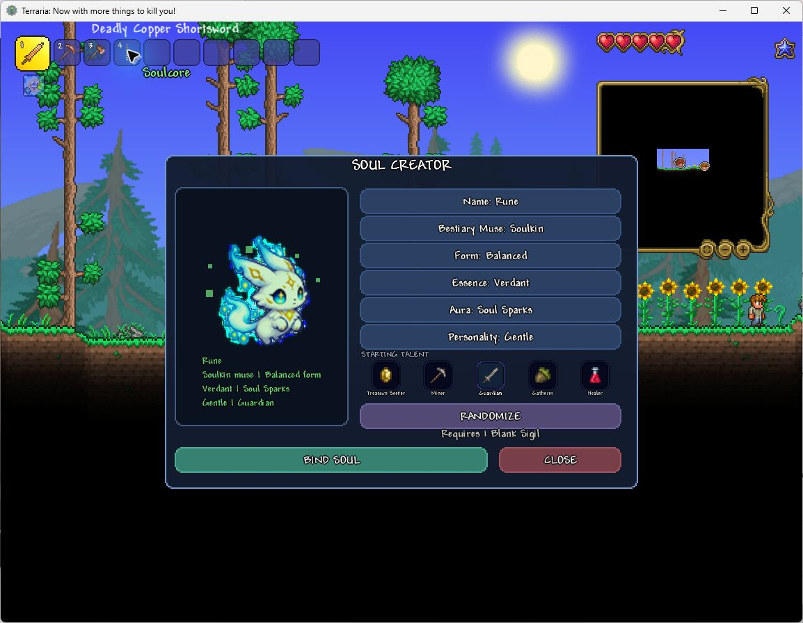
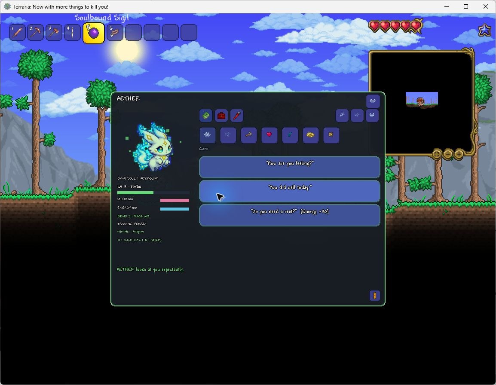
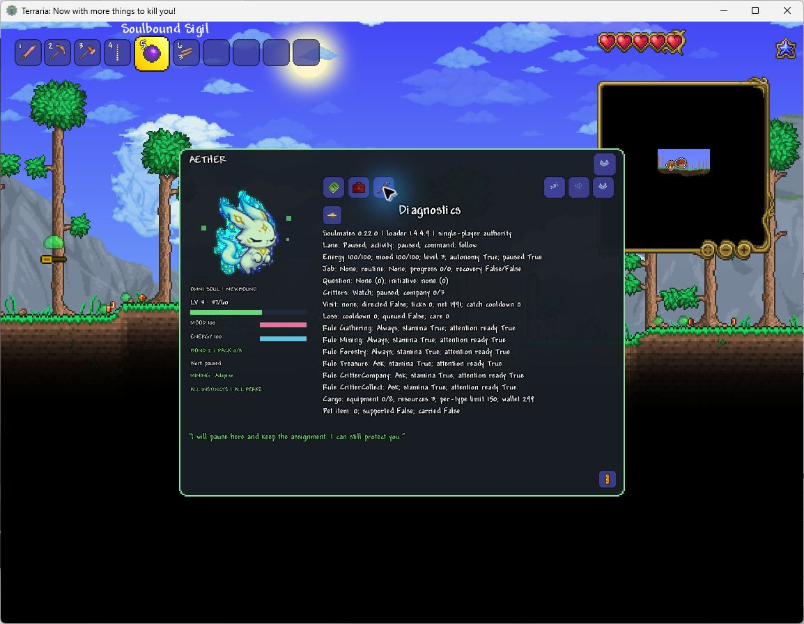

# Soulmates

Soulmates is a tModLoader mod about creating companions that feel personal. The reusable **Soulcore** opens a small companion creator. Each finished companion is stored in its own **Soulbound Sigil** with a persistent name, appearance, personality, talent, bond, mood, and energy.

## AI-assisted development disclosure

Soulmates is an experimental project created with extensive AI assistance across programming, writing, interface work, and visual development. The Workshop icon, mod icon, and custom Soulkin sprite were AI-generated and then integrated into the mod. Bunny, Blue Slime, Bird, Squirrel, item, inventory, and emote visuals reuse Terraria assets. The creator playtests the mod; automated checks and their remaining scope are documented separately for each version.

## Getting Started

1. Subscribe to the [existing Workshop item](https://steamcommunity.com/sharedfiles/filedetails/?id=3807130821), enable Soulmates and reload mods. Check for **0.22.2 - Living Critters** under Mods. The [matching GitHub beta release](https://github.com/reirao/Soulmates/releases/tag/v0.22.2) provides the verified package directly; do not install duplicate copies. Steam upload, approval and subscriber delivery are separate checks.
2. Enter a world. The one-time starter kit provides a Soulcore and three Blank Sigils; the recipes below also let you craft replacements.
3. Use the Soulcore or right-click it in the inventory. Choose the companion and bind a Sigil. The Soulcore is reusable; use the new Sigil to summon her and keep it in your inventory.
4. Right-click her for companion tools; right-click yourself for player tools. Work opens Config and Last. Games contains Rock, paper, scissors. Critters contains Watch, Company, Catch Critters, Off and Companion pet. Ordinary catching already has the built-in basic net capability.
5. Commands controls autonomy, Pause/Resume/Abort and separate Ask/Always/Never rules. Yes permits one opportunity; Always remembers permission for that ability. Details or `V` opens conversations and stats; Pack separates equipment, resources and the uncapped wallet.

If she is waiting, check the active assignment, Stay/Pause, autonomy, the ability's permission and energy. Recovery needs a reserve before work resumes. Watch does not catch; Company and Collect have different permissions. If a native NPC/chest/item handles a right-click, Terraria mode deliberately leaves that interaction alone. Select Me/Soulmate for explicit world context, and use X/Escape to leave it.

For a first check use [the character/critter checklist](tests/PLAYTEST-CRITTER-CHARACTER-0.22.0-DE.md) and [the current repair checks](tests/LIVING-CRITTERS-0.22.2-2026-10-08.md). Full beta acceptance is still open; report action, expected result, actual result and solo/MP. Mailbox notes stay local unless you explicitly share them.

0.22.2 repairs expired-spawn critter recognition, ground visibility and moving-animal visits. Installed on October 8, it received the creator's positive in-game confirmation and Workshop upload on October 9. Its [repair evidence and acceptance steps](tests/LIVING-CRITTERS-0.22.2-2026-10-08.md) distinguish isolated native tests from that player report, not an exhaustive graphical acceptance run.

## Features

- Craft a reusable Soulcore and Blank Sigils.
- Receive one Soulcore and three Blank Sigils once per character as a starter kit.
- Create multiple unique companions from fully localized presets.
- Shape a companion through an animated live preview with an original eight-frame Soulkin sprite, including compatibility for existing Sigils.
- Choose a name, form, essence color, aura, personality, and one of five visible starting-talent classes.
- Choose a visual Bestiary Muse: Soulkin, Bunny, Blue Slime, Bird, or Squirrel.
- Summon exactly one active companion at a time; switching Sigils cleanly retires the previous companion, assignment, and projectiles.
- Right-click the summoned companion or your own character to open the compact Soulwheel.
- Hold Up and right-click the Sigil to recall it.
- Companion identity and progression data are saved on the Sigil. Keep the active Sigil in the player's inventory; moving it out recalls the companion. In single-player, holding it on the cursor while rearranging inventory preserves the binding.
- Personality-driven idle, wander, inspect, follow, and catch-up behavior.
- Persistent per-companion autonomy, switchable from the action wheel.
- Talent-driven initiative: every companion retrieves nearby usable drops, Gatherers do so faster and farther, Miners help in short bursts and collect what they mine, Treasure Seekers investigate nearby chests, Guardians intercept danger, and Healers react to injuries.
- Persistent learning insights adapt to the owner's gathering, mining, forestry, combat, and exploration habits.
- All vanilla and modded ore families are recognized; companions remember safe natural materials they watch the owner mine and reuse discovered pickaxes for later mining assignments.
- Terraria is the default mouse mode: native interactions run first. If they do not handle a right-click on a nearby NPC, loose drop or natural resource, its context wheel opens directly with the target name and applicable actions. Empty air and furniture do not open a fallback wheel. Right-click your character or companion for their wheel, then choose Terraria, Me or Soulmate with native-symbol selectors. Selecting Me or Soulmate closes the wheel and arms the next world right-click. Me points or opens player emotes; Soulmate offers Look, Gather, Mine and Forest tasks, plus Company for eligible critters. The original target stays selected while moving onto the wheel. Right-click inside an open wheel cycles modes; X or Escape restores normal use. Inventory, typing, NPC dialogue, alternate item actions and cursor-held items retain priority.
- Showing a nearby drop or tile invites a shared observation shaped by personality and chosen voice. Soft and Playful have distinct character replies; Direct stays factual. Tired or low-mood companions can look with you quietly. Inspection adds no XP, consumes nothing and changes no assignment or work permission.
- Choose Look, Gather, Mine, or Forest to point at nearby targets repeatedly. Right-click an active tool opens the Area wheel; Escape exits targeting. Look reports an opportunity without changing the assignment, cargo, or terrain.
- Opening the mining target reveals nearby ore families as their real Terraria item icons; choose one immediately or keep the pickaxe node for a manual world target.
- Choose a persistent mining approach per companion: Adaptive priorities, a narrow Tunnel to ore or the next opening, ore-only Vein work, or exposed-only Surface work. Unstable sand-like materials are skimmed only from open edges.
- Work > Config unfolds area work, pointed work and Mining Mode. Last stores the last accepted work intent on each Sigil; changing settings, failed orders and Look do not replace it. Area mining repeats its remembered approach, direction and stop mode. Pointed mining, gathering and forestry re-arm a fresh world target, never a saved location or item slot. Repeating does not grant automatic permission.
- Config > Mining Mode > Tunnel opens a compass: Up, Right, Down, Left or the existing automatic ore route. Cardinal tunnels are three tiles tall or two tiles wide, bounded to eight steps for Short or up to 24 toward a player-sized opening. The existing work radius may reduce that bound. Liquid, unstable material, protected tiles and decorations stop the cardinal route, including changes after planning. Configuration creates no work by itself; changing it during area mining replans that assignment.
- Work > Config > Mining Mode > Automatic mining selects individual ore and observed-block permissions with paged Terraria item icons. Ores start allowed; observed terrain requires opt-in. Rules persist per Sigil and govern autonomous mining, not direct orders. Every mining route preserves blocks touching plants, saplings, trees or placed decorations, including targets that change after planning.
- Useful pack contents matter in the world: weapons strengthen companion attacks, torches add light, and food or recovery items can be used at an appropriate moment.
- Near a crafting opportunity, a companion may occasionally suggest a recipe inspired by carried materials.
- Contextual initiative prompts let you answer opportunities with Terraria emotes: Yes, No, Always, or Never. Commands > Initiative Rules cycles Ask, Always and Never independently for gathering, mining, forestry, treasure hunting, critter company and critter collecting. New critter rules default to Ask on existing Sigils. Yes authorizes one target; Always never grants another ability. Reset stops automatic work and restores Ask. Direct target orders are explicit consent for that visit, not permission for future visits. Registration checks cover every autonomous ability so new ones cannot inherit an unrelated rule silently.
- Occasional personal questions use four native-symbol answers: approve ongoing nearby collection, choose a playful tone, choose gentle company, or talk later. Answers affect mood, bond and saved voice without approving unrelated terrain changes.
- Approved automatic work continues during personal questions; acknowledged inventory transfers reject conflicts, and deferred critter-care questions retain their place. See the [historical repair verification](tests/COMPLETE-REPAIRS-2026-10-04.md), not a live multiplayer certification.
- An uncapped wallet can offer newly accumulated savings with personality-specific "Here for you!" lines. Accept the coins, keep saving together, respond playfully, or defer; anything that does not fit stays in the wallet.
- Nearby opportunities share an attention scheduler weighted by proximity, talent, recent observed habits, and waiting time. Repeated drops cannot indefinitely starve other actionable tasks; work-kind cooldowns are independent. Only one permission prompt is presented at a time; combat, explicit work, Stay and low-energy recovery retain priority.
- The learned Forester perk lets a companion shake trees, clear natural fallen logs, collect seeds, and carefully replant carried acorns.
- Initiative answer wheels open at the player; the companion shows the task symbol, then a question mark. Their positions stay still while choosing.
- A companion named **AETHER** is an Omni Soul with every starting talent instinct and learned perk available.
- The Critters branch offers Watch, Company, Catch Critters and Off. Hover and selection feedback distinguish watching, real follower count, pause, busy work, autonomy off and consent. Watch greets nearby natural critters with a creature > greeting expression and a native reply, without moving toward or catching it. Queued observations wait behind speech and questions; departed creatures receive no stale replies. Catch Critters includes a built-in basic net, not a withdrawable item. A carried lava-proof net upgrades it; cargo limits apply. Gold, statue-spawned and player-released creatures remain protected.
- Company gently guides existing natural bunnies, squirrels, birds, butterflies, fireflies and lightning bugs. An ordinary companion invites one; AETHER invites up to three. These are temporary real world NPCs, not spawned copies or permanent saved pets: native collisions, damage, catching and despawning still apply. Stragglers are not teleported through terrain. Off and recall release them.
- NPC context offers Look, Company and Collect for the clicked eligible critter. Direct visits replace current work even when autonomy is off, without changing automatic consent. Collect requires cargo space and the appropriate native net. Automatic visits still need autonomy, consent and stamina. Defense and open prompts retain priority; visits are bounded to six seconds and recheck the original NPC type. Existing followers remain invited when autonomy is disabled, stop guided movement on Pause and can hop at small ground obstacles without noclip or teleporting.
- Tree context uses Terraria's trunk classifications, including mushroom trees, for its native tree symbol. Forestry remains reachable during a shake cooldown or on a non-shakeable tree and reports when no supported action is available. Automatic shake planning rejects unsupported tree/soil combinations instead of repeatedly selecting them; native tree-shake loot remains authoritative. Bare-branch pruning is limited to verified vanilla side-twig frames, not palm fronds or other unverified families.
- Nearby witnessed critter deaths can prompt personality-specific sorrow or an apology, and stronger disapproval when Terraria records player attack credit. Unknown causes do not accuse a particular player. Native catches are not deaths; reactions are rate-limited, wait behind ongoing speech and grant no XP or penalties. Soul Bolts cannot accidentally hit harmless critters. 0.22.2 fixes the expired-spawn classification that excluded ordinary animals; individual live reaction timing still needs focused checks.
- AETHER's existing cosmetic native-sprite flock still represents up to six real carried insects and disappears when withdrawn. No free critters or combat swarm are created.
- Critters > Companion pet selects one Zephyr Fish or Baby Hornet backed by a real Zephyr Fish/Nectar item in her Equipment pack. Store the item through Talk > Pack, then choose its native icon. Missing items cannot be selected. The item is not consumed or moved out of cargo; the selection persists on the Sigil. Dismiss clears the selection; withdrawing its last supporting item ends the pet. Recall, owner death and changing companions remove its projectile without losing cargo.
- The companion familiar is a harmless Soulmates projectile with Terraria's animated pet sprite and companion-following movement, not the original player-anchored pet AI. It neither adds player buffs nor replaces your own pet. Only these two flying vanity pets are supported; ground pets, light pets and modded pet items are not implemented. Appearance Muse, real Critter Company and AETHER's insect flock remain separate.
- Personality-driven autonomous moments add small surprises without overriding combat, Stay, explicit assignments, or low-energy recovery.
- Persistent companion experience with 20 levels earned from combat, healing, work, and shared moments.
- Use the compact Companion Soulwheel for commands, work, bonding, direct pack access, and details.
- Right-click your own character for a separate Player wheel with Emotes, Point, and Mailbox buttons. Emotes unfolds all 151 vanilla Terraria emotes in crescent categories: Feelings, Gestures, Activities, Items, World, People & creatures and Notifications. Larger groups have small subcategories; signals, hunger, ailments and bosses no longer share the feelings list. The configurable **Player Emote Wheel** key (`G` by default) opens Emotes directly.
- Player Emotes > Items first offers Food, Recovery, Tools, Weapons, Materials, Valuables and Party groups, then their native symbols. All vanilla emotes remain reachable with stepwise Back. Ore conversations are separate under Companion > Items > Ores.
- Companion > Bond groups its six direct interactions into Feelings (Heart, Laugh), Gestures (Wave, Cheer) and Care (Comfort, Rest). Games remains a separate companion branch. The current emote path is shown between hover labels; page arrows never leave the selected leaf.
- Native Terraria emote bubbles for shared gestures, with occasional context-aware speech instead of constant text.
- Companion Soulwheel > Games > Rock, paper, scissors unfolds three native move symbols. Bond keeps its gestures separate. Games is a dedicated category for future additions; no other minigames are implemented yet. Ordinary player RPS emotes also start a real round. A nearby bound companion chooses independently, shows her move and reacts to the result. Games grant no XP and do not interrupt assignments or change work permissions.
- Social encounters include a greeting, a native NPC emote, and a personality-aware reply. Resident relationships remember world, NPC type, and name, with wary, new, familiar, and friend states. Combat and explicit work interrupt the visit.
- Talk Mode > Bond > "Who have you made friends with here?" cycles local resident relationships. Meeting someone and making a friend add chronicle memories; NPC conversation does not generate experience.
- Personality-specific reactions to normal victories, bosses, and nearby critter deaths.
- Companion Soulwheel > Items opens the categorized conversation directly. Selecting Food, Ores, Tools or another native-symbol topic immediately gives a matching cargo reply. Talk Mode also has Care, Commands, Work, Bond, Voice and Pack; inspection does not consume or invent cargo.
- "Do you remember?" tells short personality-aware chapters from actual saved events, with truthful present observations when no matching memory exists. Confirmed pickups, critter greetings and losses can enter the bounded chronicle. Long replies scroll in Talk Mode; ambient remarks wait behind speech and prompts.
- Commands > Pause retains current work, Resume continues it, and Abort clears it and holds automatic work until resumed or replaced. Defense remains available. The hold persists on the Sigil; exact live directed targets do not persist across recall or reloading.
- Mood-, energy-, bond-, and personality-aware replies, including clearly explained refusals.
- Five visible bond ranks with growing work radius, role strength, and pack capacity.
- Every companion continuously defends against nearby threats without spending work energy, while staying leashed to its owner or Stay anchor; Guardians react faster, reach farther, and hit harder, while Healers provide energy-limited support.
- Energy returns during following and work, with faster recovery while waiting; combat pauses recovery. Work effort costs one energy per eight retrieved stacks, four mined blocks or two forestry actions. After exhaustion, automatic or retained work rebuilds a 30-energy reserve before resuming. Care > Rest is an optional boost.
- Area assignments: locate nearby chests, clear every reachable ore vein and learned material in range, and retrieve every loose item in range.
- Right-clicking a workbench opens Terraria's inventory and refreshed crafting list as a small quality-of-life interaction.
- A persistent memory chronicle covering creation, work, protection, healing, equipment, and bond milestones.
- Craftable Starfinder Bell, Delver Charm, and Hearth Ribbon companion trinkets.
- Resting companions recover mood and energy over time.
- Cargo has three persistent compartments: Equipment, Resources, and Wallet, selected using Terraria item icons in the Pack view.
- Equipment retains the 8-slot pack, bond upgrades, Hearth Ribbon expansion to 12 slots, and 99-unit reserve per item type.
- Resources have 60 stack slots, displayed in pages of 12. Their reserve grows by 50 units per companion level and item type: level 1 holds 50, level 10 holds 500, and level 20 holds 1,000. Native item stack limits still apply.
- The separate wallet stores collected copper, silver, gold, and platinum as one exact balance with no amount or level cap. Money does not occupy cargo slots or generate free currency.
- The Pack conversation can inspect cargo, store the selected hotbar item in its appropriate compartment, or return cargo and wallet coins to the owner.
- Cargo slots show tooltips; left-click returns a stack and right-click one item. Wallet coin icons withdraw that denomination, converting from the shared balance when needed. A withdrawal is bounded by Terraria's coin stack size, and anything the player's inventory cannot accept stays with the companion.
- Existing Sigils migrate materials and coins into their new compartments. Resources exceeding the companion's level reserve are returned on summon, rather than silently deleted.
- Companions illuminate dark spaces and reveal the nearby world map as they explore.
- Work refusals are deterministic and explain whether mood or energy is too low.
- The selected work routine survives recalls and summons; exact live targets do not survive recall or reloading. Area work ends when no eligible target remains and reports when a new assignment is needed.
- Press the configurable **Talk to Companion** hotkey (`V` by default) to open Talk Mode without selecting the Sigil.
- Choose **Details** on the companion action wheel, or press `V`, to open the resizable Talk Mode with a real level bar, mining approach, bond, mood, energy, pack, memories, and conversations.
- Stay is a true world anchor: companions defend that location without drifting back to the player.
- Play in all nine languages supported by Terraria 1.4.4: English, German, Italian, French, Spanish, Russian, Brazilian Portuguese, Polish, and Simplified Chinese. Soulmates follows the game's selected language; no separate language setting is needed.
- Optional local **AETHER Field Notes** record anonymized gameplay events and compact behavior signals for playtesting; nothing is uploaded. Use `/soulfeedback on` to opt in, `/soulfeedback note <text>` for an observation, and `/soulfeedback bug <what happened>` to save a bug with its recent gameplay context.
- Open the in-game **AETHER Mailbox** from the paper-plane icon on the Companion Soulwheel, or with `/soulfeedback`, to send ordinary feedback or a contextual bug report without leaving Terraria.

The current release supports single-player and server-authoritative multiplayer companions. Summoning, recalling, conversations, jobs, pack actions, and trinkets are validated by the server and synchronized back to the owning player.

## Current Build

**0.22.2 - Living Critters | Beta Candidate.** Installed in the normal client on October 8, 2026. The creator confirms it works in play and has uploaded it to the existing Workshop item; Steam records **October 9 at 08:05 CEST**, with review pending at the publication check. Upload, approval and each subscriber's installed version are separate checks. See [release notes](releases/0.22.2.md) and [installation verification](tests/CLIENT-INSTALL-0.22.2-2026-10-08.md).

The root critter failure was Terraria's temporary spawn-protection flag: after it expires, harmless catchable animals need not remain `friendly`. 0.22.2 uses their permanent native classification, keeps ground-level visibility valid, aligns approach/reach and improves real follower catch-up without bypassing walls or native physics. Critter/drop context works over cuttable foliage; missing pet items give a visible explanation. The [repair report](tests/LIVING-CRITTERS-0.22.2-2026-10-08.md) preserves the cause, failed baseline and counterchecks. Earlier cargo, speech, Soulcore animation and minimap repairs remain included.

Details/`V` separates Conversation, Equipment and Diagnostics, with portrait/vitals and an independent reply strip. Tool displays, item-backed pets, cargo and Pause/Resume/Abort retain existing actions; tools are capabilities, not generic armor slots. Explicit wrench export writes `SoulmatesFeedback/diagnostic-latest.txt` locally without enabling recording or uploading. MP labels client state, not server history; technical details remain English.

The release also includes semantic emote categories, per-Sigil Work **Config/Last**, the bounded tunnel compass, shared critter scheduling and two item-backed flying pets from the intervening candidates. Zephyr Fish/Nectar are the only supported pet items; the harmless follower uses native animation, not original player-pet AI. Ordinary critter catching has a built-in basic net capability. Existing Sigils remain compatible; all multiplayer peers need **0.22.2**.

The exact 1,586,271-byte package passed **90,691 native-engine assertions in each of two repeated runs**, **176 independent safety expectations** and **54,126 static/controller/localization assertions**. Native runtime cases include normal NPC/projectile updates and physics, not a played world. Production compilers reported zero warnings/errors; the general test-only probe has 33 known compatibility warnings. All nine catalogs contain 918 keys. SHA256: `7A9312816042843D160E220C0CB3DAD12AF3D5FA534D5FFF5D3752E9A9520BB2`.

These are bounded automated checks, not completed beta acceptance. The creator's positive 0.22.2 playtest is separate evidence and does not certify every feature. Individual critter-loss timing, pet combinations, full progression, endurance, common UI scales and connected multiplayer need focused sessions. See [BETA.md](BETA.md). Activity modules still share NPC state; this is not a fully pluggable behavior engine.

Some multiplayer conversation/work replies retain the server language; menus, local interactions, key-based speech and minigame results use the client's language. AI-authored translations need native-speaker feedback. Documentation describes implemented scope, not an unagreed future roadmap.

The maturity gates for Alpha, Beta, release candidate, and 1.0 are defined in [VERSIONING.md](VERSIONING.md). The former `9.9.x` values were experimental build counters and remain in the changelog only as project history.

Workshop update text comes from [changelog.txt](changelog.txt), which contains only the current update. [CHANGELOG.md](CHANGELOG.md) preserves the complete development history separately so it cannot be accidentally republished in every Workshop entry.

## Actual Gameplay

The [October 5 Classic showcase](media/current/showcase-0.22.0/README.md) contains **20 genuine unaltered 0.22.0 captures**, not generated mockups or relabeled current-version images. It shows creation, wheels, character views, an actual wallet transfer, games and work configuration, including the bugs that prompted follow-up repairs. No new 0.22.2 screenshot set is claimed. An open menu is not proof that its full behavior completed.

The [earlier creator gallery](media/current/README.md) preserves the October 1 screenshots and video frames in their original framing. Those images document project history, not the current interface. Gallery assets are excluded from the mod package.

## How Soulmates got here

Soulmates began as a reusable item for shaping a personal pet. Repeated in-game passes added persistent Sigils, personalities, combat support, work, cargo, learned behavior, forestry, initiative choices, native emotes, and the Soulwheel. Several systems were rebuilt when real play exposed awkward controls, disappearing cargo, duplicate drops, or stale abilities. The full sequence is preserved in [CHANGELOG.md](CHANGELOG.md); this page describes the current beta-candidate scope without promising future features.

## Playtesting and feedback

Every report helps. The creator has limited time to play and Terraria progression takes time, so some combinations and long-session behavior are necessarily discovered slowly. If something behaves strangely, feels unclear, or breaks later in a playthrough, please describe what happened and whether it was single-player or multiplayer. And if a companion simply made you smile, we are just as happy to hear that.

Please share findings through the [Steam Workshop page](https://steamcommunity.com/sharedfiles/filedetails/?id=3807130821) or [GitHub issues](https://github.com/reirao/Soulmates/issues).

For local playtests, open the paper-plane icon on the Companion Soulwheel or enter `/soulfeedback` for the in-game **AETHER Mailbox**. It can enable the opt-in Field Notes, send a normal note, or preserve a bug report with recent context. Files are stored under tModLoader's save folder in `SoulmatesFeedback`: a bounded JSONL session journal, `latest-summary.json`, `bug-inbox.jsonl`, and separate typed `notes-inbox.jsonl`. Failed automatic writes retain at most 64 events with a 30-second retry backoff and loss accounting, rather than an unlimited queue. Failed manual saving does not clear the mailbox text. New automatic records exclude account, player, character, and world names, chat text, and exact coordinates. Manually typed notes retain their text, up to 360 characters, so avoid including anything you do not want stored. Nothing is uploaded. Older logs are not rewritten. Use `/soulfeedback off` to stop future recording; existing notes remain yours until you remove them. Local notes do not automatically reach the developer; share only the specific note you want reviewed.

## Languages

- English (`en-US`)
- German / Deutsch (`de-DE`)
- Italian / Italiano (`it-IT`)
- French / Français (`fr-FR`)
- Spanish / Español (`es-ES`)
- Russian (`ru-RU`)
- Brazilian Portuguese / Português do Brasil (`pt-BR`)
- Polish / Polski (`pl-PL`)
- Simplified Chinese (`zh-Hans`)

All nine Terraria 1.4.4 languages have complete 918-key catalogs in 0.22.2. Soulmates follows Terraria's language selection, with English as fallback. Seven translations are AI-authored; native-speaker corrections are welcome. Some MP replies retain the server language; technical diagnostics remain English. See [localization maintenance](tests/localization/README.md).

## Install for development

1. Install Terraria and tModLoader through Steam.
2. Copy or clone this folder into `Documents/My Games/Terraria/tModLoader/ModSources/Soulmates`.
3. Open tModLoader and choose **Workshop > Develop Mods > Build + Reload**.

The project targets the current tModLoader 1.4.4 stable release. In the normal ModSources folder the project automatically uses `tModLoader.targets`. For development elsewhere, set `TML_PATH` to a tModLoader installation containing `tMLMod.targets`.

## Recipes

- **Soulcore:** 8 Fallen Stars, 5 Amethyst, and 10 Stone Blocks at a Work Bench.
- **Blank Sigil:** 3 Fallen Stars, 1 Amethyst, and 5 Silk at a Work Bench.
- **Starfinder Bell:** 5 Fallen Stars, 3 Iron or Lead Bars, and 1 Lens at an Anvil.
- **Delver Charm:** 5 Iron or Lead Bars, 2 Amethyst, and 20 Stone Blocks at an Anvil. Expands mining radius and speed.
- **Hearth Ribbon:** 5 Silk, 2 Daybloom, and 2 Fallen Stars at a Work Bench.

## License

MIT
