# Soulmates: October 1 Gameplay Archive

Historical captures supplied by the creator on October 1, 2026. See the [October 5 Classic showcase](showcase-0.22.0/README.md) for the later 20-image series. Neither gallery is relabeled as 0.22.1. The first three below are the creator's favorites. All individual PNGs are unchanged: no generated imagery, added UI, retouching, resizing, or additional cropping. Screenshots retain original framing; frames from `SOULMATES.mp4` retain 1280 x 720 resolution.

These images document moments of play, not exhaustive verification of every feature. The older September 29 screenshot and previous galleries are not included.

## Creator Favorites

### Soul Creator
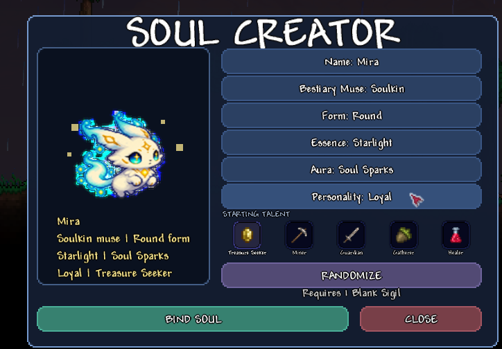

### Soulkin Companion
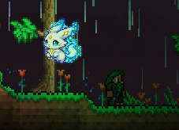

### Native Emote Wheel
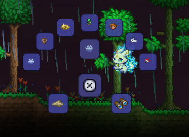

## More Creator Screenshots

### AETHER Talk Mode
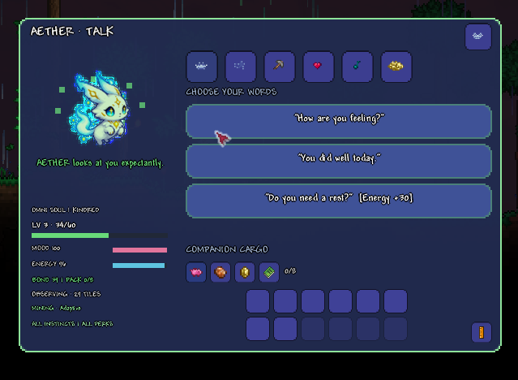

### Player Wheel
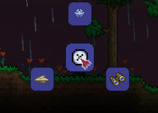

### Local Feedback Mailbox
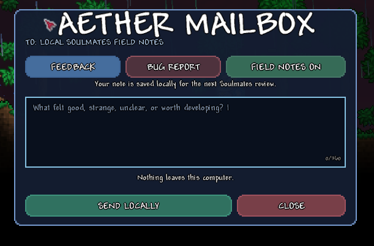

### Forest Target Feedback
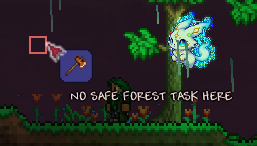

### World Point Tools
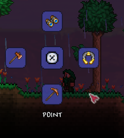

### Companion Work Wheel
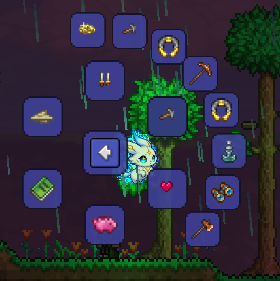

## Frames From the Gameplay Video

### 00:07 - Companion Wheel
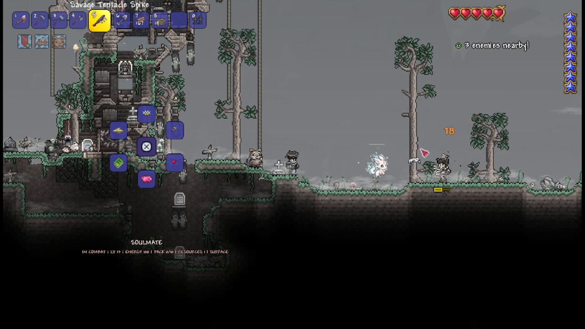

### 00:14 - World Point Wheel
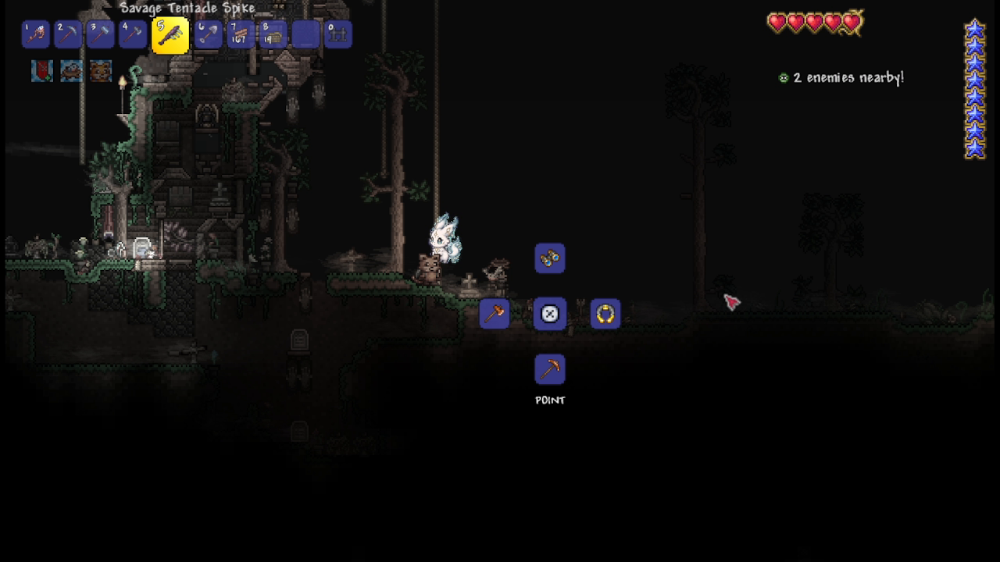

### 01:03 - Forestry Suggestion
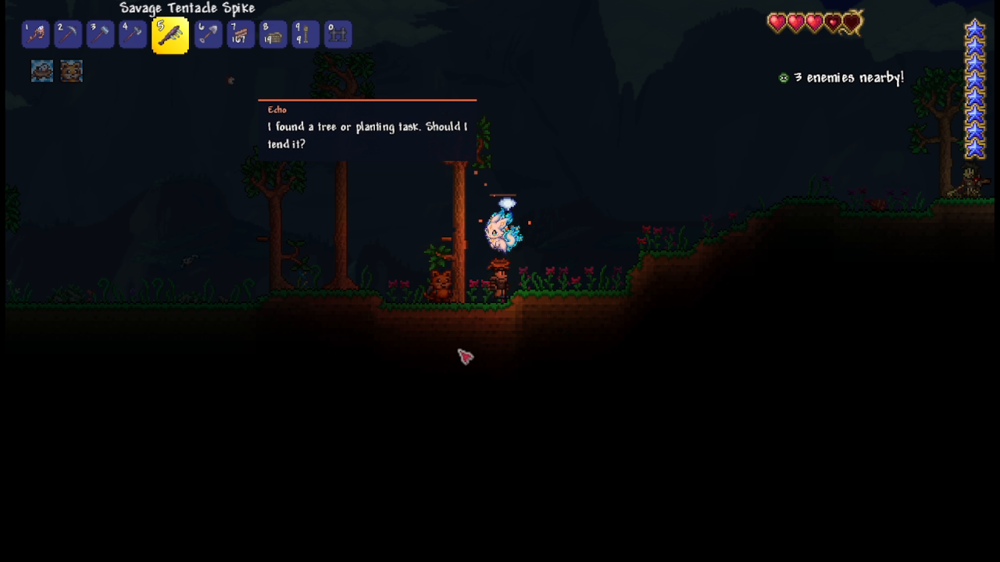

### 01:10 - Combat Moment
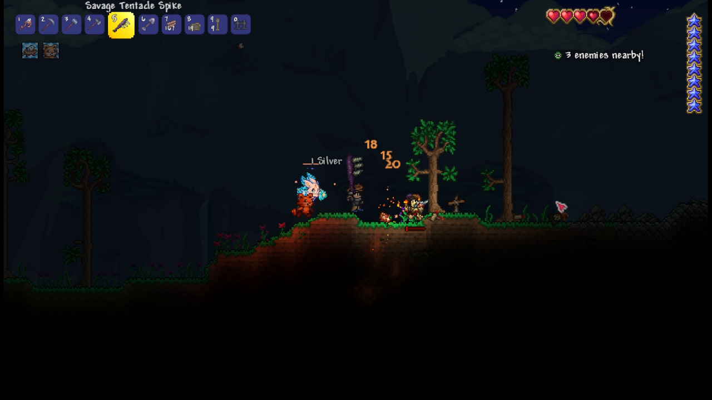

### 01:31 - Town Emotes
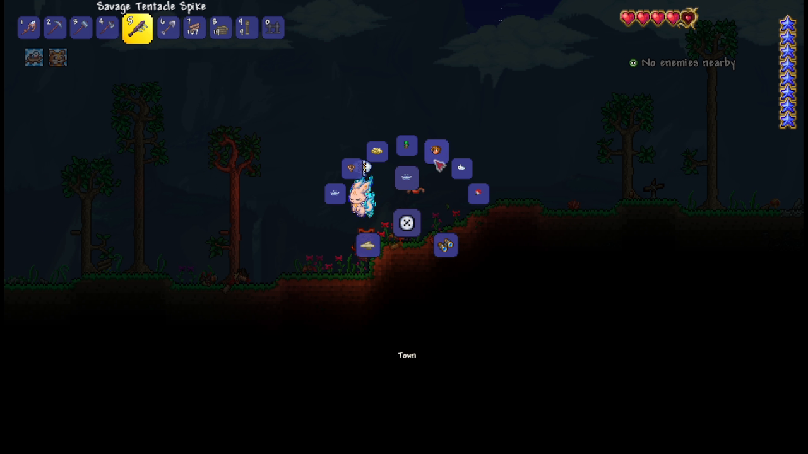

### 01:52 - Mining Answer Wheel
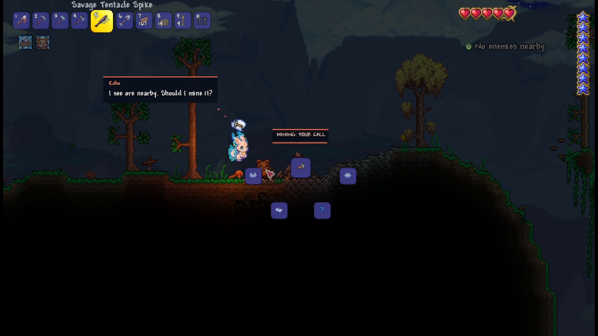

### 02:13 - Nature and Weather Emotes
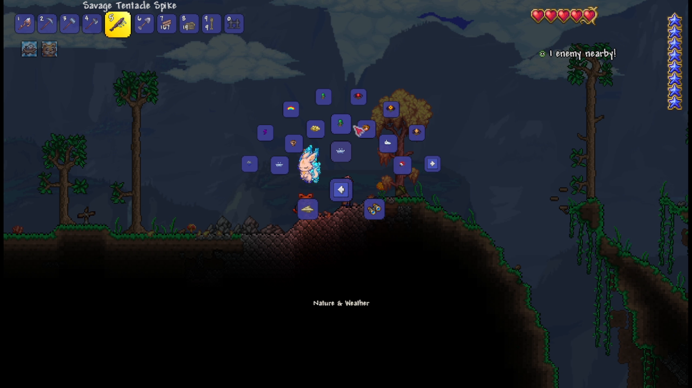

### 02:34 - Echo Conversation
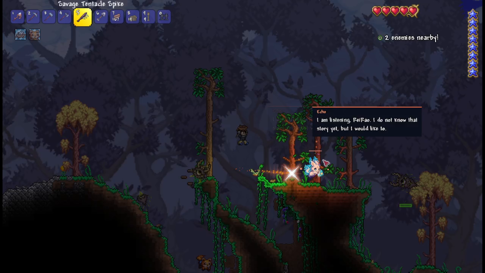

Download the [complete screenshot bundle](https://github.com/reirao/Soulmates/releases/download/v0.15.0/Soulmates-screens.zip). [provenance.json](provenance.json) records origins, video timestamps, and source-verified SHA256 hashes. Gallery images are excluded from the `.tmod` package.
